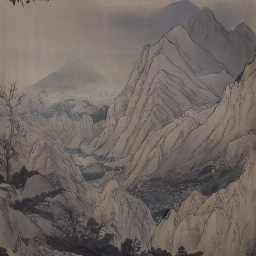
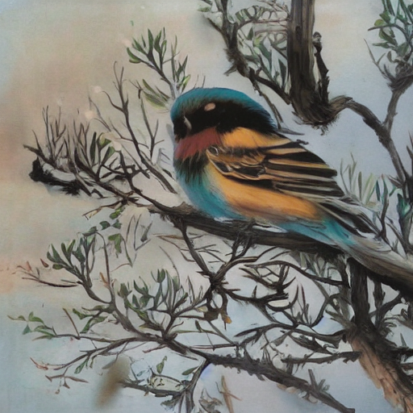
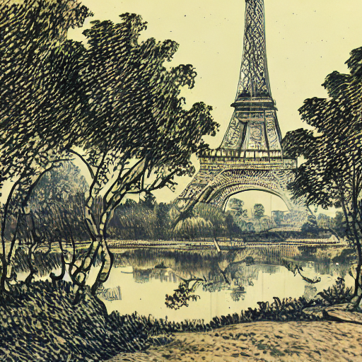
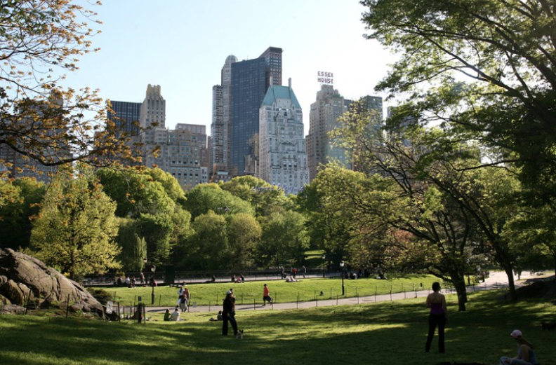
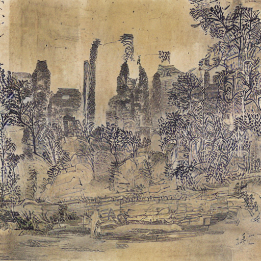
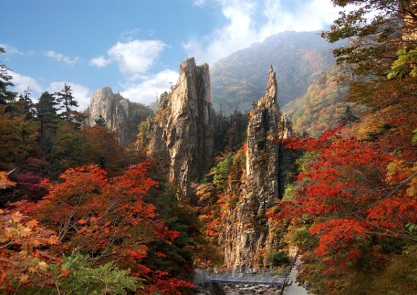
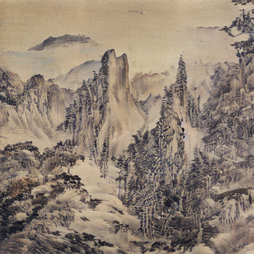
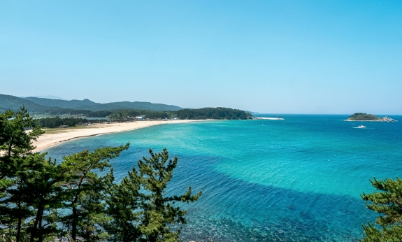
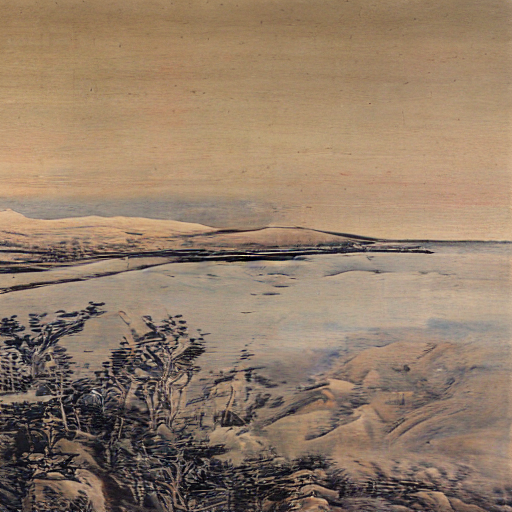

# Introduction
[choosa](https://huggingface.co/calihyper) is a model that fine-tuned the [StableDiffsuion_v1-5 model](https://github.com/runwayml/stable-diffusion) with the [Textual Inversion](https://huggingface.co/docs/diffusers/training/text_inversion) method for Korean traditional paintings.

# environment
**Installing the dependencies**    
```python
pip install .  # first
pip install -r requirements.txt # Second
```

# inference
**1. Text to Image**   
You can find more detailed information [Text-to-Image Generation](https://huggingface.co/docs/diffusers/api/pipelines/stable_diffusion/text2img)   
```python
from diffusers import StableDiffusionPipeline
import torch

model_id = "calihyper/trad-kor-landscape-black"
pipe = StableDiffusionPipeline.from_pretrained(model_id, torch_dtype=torch.float16).to("cuda")

prompt = "a painting of Eiffel tower in Paris <trad-kor-landscape-ink-wash-painting>"
negative_prompt = "chinese writing"
image = pipe(prompt, negative_prompt = negative_prompt, num_inference_steps=20, guidance_scale=2.5).images[0]

image.save("Eiffel tower.png")
```

**2. Controlnet-canny**   
You can find more detailed information [Text-to-Image Generation with ControlNet Conditioning](https://huggingface.co/docs/diffusers/api/pipelines/stable_diffusion/controlnet)

```python
from diffusers import StableDiffusionControlNetPipeline
from diffusers.utils import load_image
# Let's load your image
image = load_image(
    "your image.png"
)
```
First, we need to install opencv:
```python
pip install opencv-contrib-python
```
Next, let’s also install all required Hugging Face libraries:
```python
pip install diffusers transformers git+https://github.com/huggingface/accelerate.git
```
Now, we load our finetuned Model as well as the ControlNet for canny edges.

```python
from diffusers import StableDiffusionControlNetPipeline, ControlNetModel
import torch

model_id = "calihyper/trad-kor-landscape-black"
controlnet = ControlNetModel.from_pretrained("calihyper/trad-kor-controlnet", torch_dtype=torch.float16)
pipe = StableDiffusionControlNetPipeline.from_pretrained(
    model_id, controlnet=controlnet, torch_dtype=torch.float16
)
```
To speed-up things and reduce memory, let’s enable model offloading and use the fast UniPCMultistepScheduler.

```python
from diffusers import UniPCMultistepScheduler

pipe.scheduler = UniPCMultistepScheduler.from_config(pipe.scheduler.config)

# this command loads the individual model components on GPU on-demand.
pipe.enable_model_cpu_offload()
```
Finally, we can run the pipeline:

```python
generator = torch.manual_seed(0)
prompt = ""
negative_prompt = ""
out_image = pipe(
    prompt=prompt, negative_prompt = negative_prompt, num_inference_steps=20, guidance_scale = 2.5, generator=generator, image=canny_image
).images[0]
```
# examples
## Text To Image
   

**prompt** : a painting of village around mountain    
**style prompt** : trad-kor-landscape-ink-wash-painting    
**negative prompt** : chiense latter     
**inference steps** : 30    
**gudiance scale** : 2.8     
    
      
    
**prompt** : a painting of a bird on branch with flowers     
**style prompt** : trad-kor-plants-color     
**negative prompt** : chinese letter    
**inference steps** : 30    
**gudiance scale** : 2.5    
    
    
    
**prompt** : a painting of Eiffel tower in Paris   
**style prompt** : trad-kor-landscape-thick-brush-strokes   
**negative prompt** : chiense letter   
**inference steps** : 20   
**gudiance scale** : 4   
**seed** : 3   

## ControlNet-Canny
     
**prompt** : a painting of central park in newyork, trees on right side, road on middle of painting, buildings on background    
**style prompt** : trad-kor-landscape-ink-wash-painting    
**negative prompt** : chinese letter, river    
**inference steps** : 30    
**gudiance scale** : 2.3    
**seed** : 3    
**low threshold** : 120    
**high threshold** : 120    
    
     
**prompt** : a painting of mountain with many trees, trees on foreground   
**style prompt** : trad-kor-landscape-thick-brush-strokes        
**negative prompt** : chinese letter, river    
**inference steps** : 30    
**gudiance scale** : 2.3    
**seed** : 3    
**low threshold** : 200    
**high threshold** : 200    

     
**prompt** : a painting of coast, mountain on side, trees on foreground    
**style prompt** : trad-kor-landscape-ink-wash-painting    
**negative prompt** : chinese letter     
**inference steps** : 30    
**gudiance scale** : 2.5    
**seed** : 3    
**low threshold** : 120    
**high threshold** : 200    

    


# Reference
1. https://arxiv.org/abs/2302.05543
2. https://github.com/huggingface/diffusers/tree/main/src/diffusers/pipelines
3. https://huggingface.co/blog/controlnet
4. https://huggingface.co/docs/diffusers/api/pipelines/stable_diffusion/text2img
5. https://huggingface.co/docs/diffusers/training/text_inversion
6. https://github.com/huggingface/diffusers/tree/main/examples/textual_inversion
